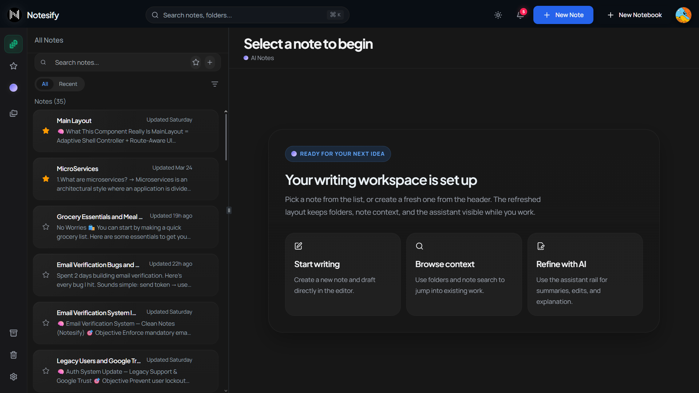
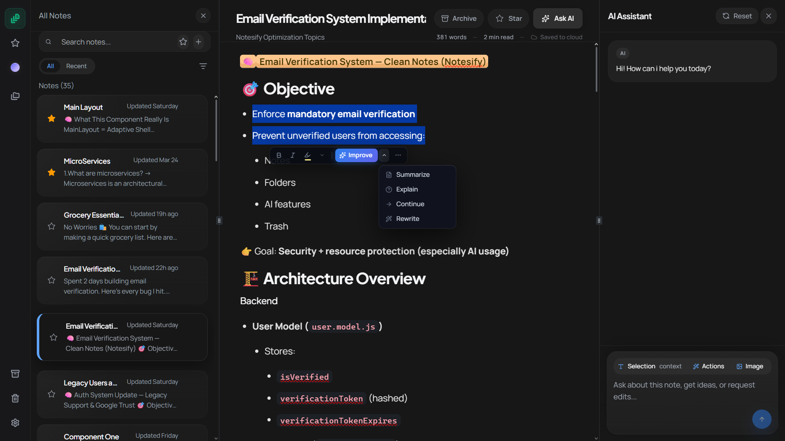
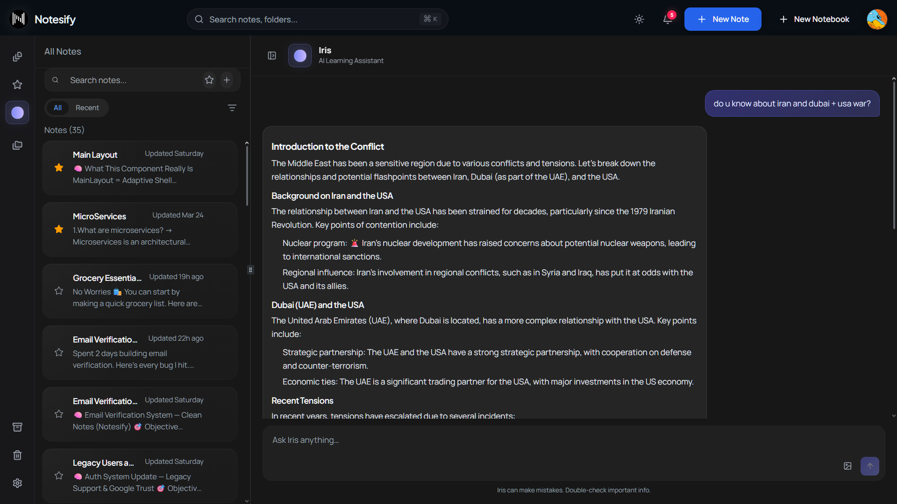
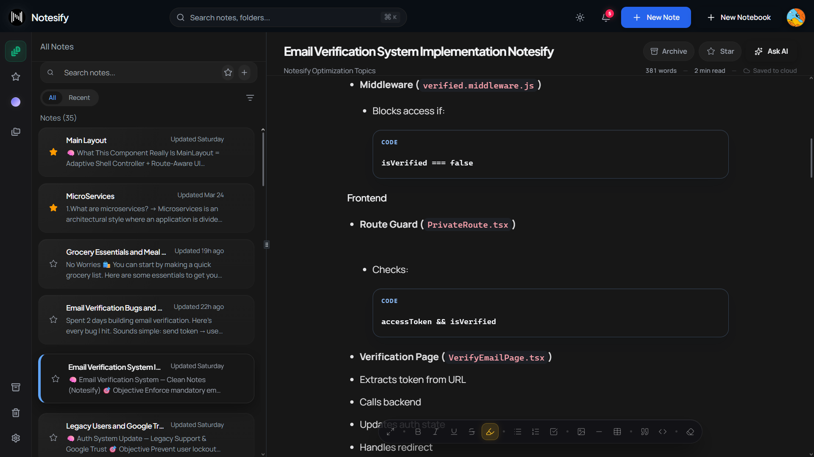

# Notesify

A production-grade, full-stack notes application built on the MERN stack — featuring a professional rich-text editor, multi-provider AI orchestration, optimistic concurrency control, and banking-level authentication patterns.

**[Live Demo](https://notesify-eta.vercel.app) · [GitHub](https://github.com/badalsahani20/fullstack-notes-app)**

<p align="center">
  
</p>


---

## Architecture Highlights

These are the non-trivial engineering decisions behind Notesify — the things that separate it from a tutorial CRUD app.

### Optimistic Concurrency Control (OCC)
All core documents carry a `version` field. Every mutation from the client must include the current version. If another session modified the document in the meantime, the backend returns a `409 Conflict` — the frontend handles state-merging gracefully instead of silently overwriting data. Combined with TanStack React Query's optimistic UI, mutations feel instant while remaining safe under concurrent edits.

### Multi-Provider AI Orchestration
Iris AI routes requests dynamically across three providers based on payload type:

| Provider | Model | Use Case |
|---|---|---|
| Groq | Llama 3.3 70B | High-speed text chat (sub-second latency) |
| NVIDIA | Gemma 2 9B | Vision / multimodal tasks (image analysis) |
| Google Gemini | 2.0 Flash | Complex content actions (rewrite, summarize, grammar) |

Cascading fallbacks ensure near-zero AI downtime: Gemini → OpenRouter (LLaMA 3) on failure, NVIDIA Vision → Groq text-only on failure.

### Production-Grade Authentication
Beyond standard JWT — Notesify implements:
- **Refresh token rotation** on every session renewal, limiting blast radius of a compromised token
- **Reuse detection** — replaying an old refresh token immediately revokes all active sessions for that user
- **5-device session capping** per user
- **3-tier email verification trust** — new users must verify, legacy accounts (pre-verification) are auto-trusted on login, Google OAuth users are pre-verified via OIDC
- **Social account linking** — Google signup automatically merges with an existing local account if emails match

### Self-Healing Redis Cache
Upstash Redis sits in front of all `GET /notes` and `GET /folders` requests, serving responses in sub-10ms. Mutations aggressively invalidate stale cache. If a cache drift is detected (404 on expected key), the system automatically re-fetches from MongoDB and re-seeds Redis — no manual intervention, no stale UI.

### SHA-256 Content-Hashed AI Caching
AI suggestions (Improve, Summarize, Grammar) are cached in MongoDB using a SHA-256 hash of the input text. Identical requests return cached results instantly — eliminating redundant LLM API calls and cutting AI feature costs.

### Token-Aware Conversation Management
Chat history beyond 20 messages triggers an automatic AI summarization task, compressing the conversation into a rolling "Context Snapshot." Old messages are purged, the snapshot is injected into the system prompt — preserving conversational memory without blowing token limits.

### Hybrid Search
MongoDB full-text indexing provides high-relevance ranking via linguistic scores. If indexed search returns no results (partial words, special characters), the system falls back to indexed case-insensitive regex — guaranteeing zero zero-result searches.

---

## Features

### Iris AI — Intelligent Writing Assistant



- **Inline Ghostwriter** — custom TipTap extension renders AI suggestions as faded ghost text before acceptance
- **Selection actions** — bubble menu on selected text: Improve, Summarize, Rewrite, Brainstorm
- **Grammar audit panel** — scans the entire note, surfaces fixes in a dedicated review panel
- **Multimodal chat** — attach images for visual analysis or OCR tasks



- **Streaming responses** — real-time token-by-token streaming via `ReadableStream`
- **Context injection** — active note content injected into system prompt for context-aware responses

### Professional Editor (TipTap / ProseMirror)



- Markdown-style shortcuts for headers, lists, bold, italic
- Drag-and-drop / paste image upload → auto-hosted on Cloudinary
- Resizable tables, task lists, auto-detected language code blocks
- Custom font sizing, text alignment, and indentation controls

### Organisation
- Recursive nested notebooks (folders + sub-folders) with lazy loading
- Real-time note counts across folder hierarchy
- Favorites (pinned notes), soft-delete Trash with one-click restore or permanent deletion
- Command palette search across active notes, archived notes, and folder names — with real-time match highlighting, contextual snippets, and full keyboard navigation

### Performance
Diagnosed and resolved four production performance bottlenecks:

| Metric | Before | After |
|---|---|---|
| LCP | ~3.0s | ~1.7s |
| INP | ~0.30 | ~0.04 |
| CLS | 0.29 | 0.04 |
| Search | Laggy (per-keystroke regex) | Instant (Map-based O(1) cache) |

Key fixes: eliminated redundant `/users/me` auth waterfall (~1.6s scripting time), replaced Framer Motion `layoutId` with opacity/translate animations (~70% CPU reduction on mount), pre-computed searchable text into a Map.

---

## Tech Stack

### Frontend
| Layer | Technology |
|---|---|
| Framework | React 18 (Vite) + TypeScript |
| Server state | TanStack React Query |
| UI state | Zustand |
| Styling | TailwindCSS + shadcn/ui + Lucide Icons |
| Routing | React Router v6 |
| Editor | TipTap (ProseMirror) + custom extensions |
| Animations | Framer Motion |
| Image hosting | Cloudinary (unsigned uploads) |

### Backend
| Layer | Technology |
|---|---|
| Framework | Node.js + Express |
| Database | MongoDB + Mongoose |
| Caching | Upstash Redis (REST API) |
| Auth | Passport.js + JWT |
| Email | Nodemailer |
| AI providers | Groq, NVIDIA, Google Gemini, OpenRouter |

---

## Project Structure

```text
fullstack-notes/
├── backend/
│   ├── src/
│   │   ├── controllers/    # Express route handlers
│   │   │   ├── ai.controller.js
│   │   │   ├── auth.controller.js
│   │   │   ├── notes.controller.js
│   │   │   └── trash.controller.js
│   │   ├── middleware/     # Auth & error middlewares
│   │   │   ├── auth.middleware.js
│   │   │   ├── error.middleware.js
│   │   │   └── verified.middleware.js
│   │   ├── models/         # Mongoose schemas (OCC versioning)
│   │   │   ├── user.model.js
│   │   │   ├── notes.model.js
│   │   │   └── globalChatSession.model.js
│   │   ├── routes/         # Express API route definitions
│   │   ├── services/       # Core business & AI orchestration logic
│   │   │   ├── ai.service.js    # Multi-provider LLM routing + fallbacks
│   │   │   ├── mail.service.js  # Nodemailer HTML templating
│   │   │   └── notes.service.js
│   │   └── utils/          # Helpers (sanitization, diffing, summarization)
│   └── server.js           # API entry point
│
├── frontend/
│   ├── src/
│   │   ├── components/
│   │   │   ├── ai/         # Iris AI message UI & results
│   │   │   ├── chat/       # Global AI chat panel
│   │   │   ├── editor/     # TipTap editor wrappers & toolbar
│   │   │   ├── folders/    # Folder tree & management
│   │   │   ├── search/     # Command palette (global search)
│   │   │   ├── ui/         # Glassmorphism & shadcn/ui primitives
│   │   │   ├── SideBar.tsx # Activity rail
│   │   │   └── TipTap.tsx  # Core editor logic
│   │   ├── extensions/     # TipTap custom extensions (AI ghost text, image)
│   │   ├── hooks/          # Domain-specific logic (useNotesQuery, useAiChat)
│   │   ├── store/          # Zustand state management
│   │   ├── pages/          # Main route components
│   │   ├── lib/            # Axios config & styling utilities
│   │   └── utils/          # Frontend helpers (HTML stripping, date formatting)
│   └── main.tsx            # React entry point
│
└── desktop/                # Electron / desktop-specific configuration
```

---

## Local Development Setup

### Prerequisites
- Node.js v18+
- MongoDB connection string
- Upstash Redis account
- Cloudinary account
- API keys: Groq, NVIDIA, Google Gemini

### 1. Clone the repository
```bash
git clone https://github.com/badalsahani20/fullstack-notes-app.git
cd fullstack-notes-app
```

### 2. Backend setup
```bash
cd backend
npm install
```

Create `.env` in `backend/`:
```env
PORT=5000
MONGO_URI=your_mongodb_connection_string
JWT_SECRET=your_jwt_secret
JWT_REFRESH_SECRET=your_refresh_secret
UPSTASH_REDIS_REST_URL=your_upstash_redis_url
UPSTASH_REDIS_REST_TOKEN=your_upstash_redis_token
GROQ_API_KEY=your_groq_key
NVIDIA_API_KEY=your_nvidia_key
GEMINI_API_KEY=your_gemini_key
OPENROUTER_API_KEY=your_openrouter_key
CLOUDINARY_CLOUD_NAME=your_cloudinary_cloud_name
CLOUDINARY_API_KEY=your_cloudinary_api_key
CLOUDINARY_API_SECRET=your_cloudinary_api_secret
GOOGLE_CLIENT_ID=your_google_oauth_client_id
GOOGLE_CLIENT_SECRET=your_google_oauth_client_secret
EMAIL_USER=your_smtp_email
EMAIL_PASS=your_smtp_password
```

```bash
npm run dev
```

### 3. Frontend setup
```bash
cd ../frontend
npm install
```

Create `.env` in `frontend/`:
```env
VITE_API_URL=http://localhost:5000/api
VITE_CLOUDINARY_CLOUD_NAME=your_cloudinary_cloud_name
VITE_CLOUDINARY_UPLOAD_PRESET=your_unsigned_preset_name
```

```bash
npm run dev
```

---

*Built with focus on production patterns, reliability, and a fluid user experience.*